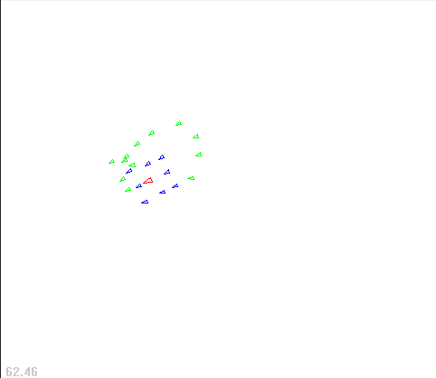
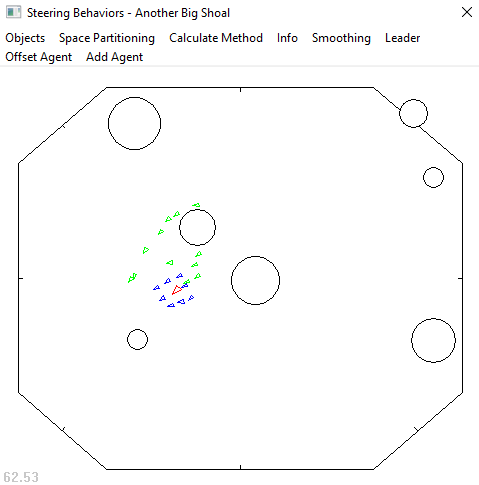

# Steering Behaviors
## About The Project
It's based on a project of Mat Buckland : *"Steering Behaviors"*.  

My goal was to simulate two crowd movements with the same code base : Follow and Protect a leader Agent.  

I've designed three types of agent, each with its own color:
- In red, the mouse-driven leader (class `Leader`).
- In blue, the leader's bodyguard, who maintains a safe distance from the other agents (class `ProtectAgent`).
- In green, the pursuers who follow the leader's every move and try to hit him (class `PursuitAgent`).

  

## Getting Started
### Usage
After launching the executable, you have access to several options in the menu section (Enabling Obstacles Collision...).  

  

I've also created several shortcuts to affect the agent's movements:
| Shortcuts  | Function                       |
| ---------- | ------------------------------ |
| Left Click | Move Leader Agent              |
| B          | Add Pursuit Agent              |
| C          | Increase Bodyguard Offset      |
| V          | Decrease Bodyguard Offset      |
| X          | Switch to my implementation    |
| W          | Switch to Mat Buckland program |

## License
Distributed under the MIT License. See `LICENSE` for more information.

## Contact
- Wesley Petit - [Website](https://wesleypetit.fr/) - wesley.petit.lemoine@gmail.com

## Credits
- [Mat Buckland, *"Programming Game AI by Example"*, Chapter 3](http://www.ai-junkie.com/books/toc_pgaibe.html).
